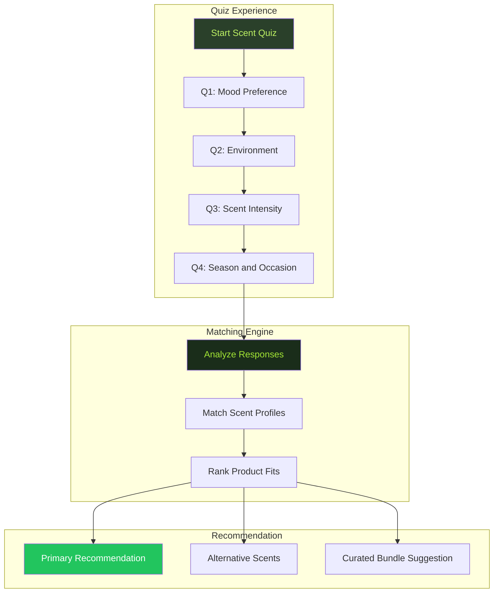
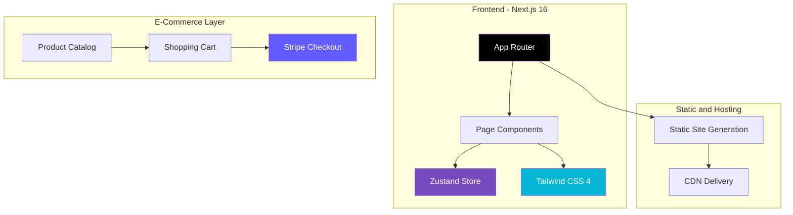

<!-- CAPSULE-RENDER HEADER -->


<!-- TYPING SVG -->
<div align="center">
  <a href="https://git.io/typing-svg">
    
  </a>
</div>

<br/>

<!-- BADGES -->
<div align="center">

[](https://www.typescriptlang.org/)
[](https://react.dev/)
[](https://tailwindcss.com/)
[](./LICENSE)

</div>

---

## Overview

**Narae** is an elegant brand website for an aromatherapy product line. Built with TypeScript and React, it features a nature-inspired design language, product catalog, educational content about essential oils, and a seamless shopping experience — all wrapped in a calming, earthy aesthetic that reflects the brand's natural philosophy and commitment to pure, sustainable ingredients.

## Visual Architecture

### E-Commerce Flow

```mermaid
flowchart LR
    subgraph Browse["Browse"]
        A["Home Page"] --> B["Product Catalog"]
        B --> C["Product Detail"]
        C --> D["Scent Profile Guide"]
    end

    subgraph Cart["Cart"]
        D --> E["Add to Cart"]
        E --> F["Review Cart"]
        F --> G["Adjust Quantities"]
    end

    subgraph Checkout["Checkout"]
        G --> H["Shipping Info"]
        H --> I["Payment - Stripe"]
    end

    subgraph Complete["Complete"]
        I --> J["Order Confirmed"]
        J --> K["Tracking and Updates"]
    end

    style A fill:#1a2d1a,color:#a3e635
    style I fill:#635bff,color:#fff
    style J fill:#22c55e,color:#fff
```



### Scent Profile Guide



### Architecture — Lightweight Next.js + Stripe Stack



> **Stack Note**: Narae uses a deliberately lighter stack than typical e-commerce apps — no Prisma ORM, no Radix UI, no heavy component library. Next.js 16 handles SSR/SSG, Zustand manages cart state, and Tailwind CSS 4 provides styling. Stripe handles checkout via hosted payment flow.

---

## Features

### Product Experience
- **Product Catalog** — Browse essential oils, diffusers, and curated blends with detailed descriptions
- **Scent Profile Guide** — Interactive quiz to find your perfect scent match
- **Product Reviews** — Customer ratings and detailed reviews
- **Gift Sets** — Curated gift collections for every occasion

### Educational Content
- **Essential Oil Guide** — Comprehensive information on each oil's properties and uses
- **Usage Instructions** — Diffusion, topical, and inhalation safety guidelines
- **Blog** — Wellness tips, seasonal blends, and lifestyle content
- **FAQ** — Common questions about aromatherapy practices

### Shopping and Subscription
- **Shopping Cart** — Add to cart, checkout, and order tracking
- **Subscription Boxes** — Monthly aromatherapy subscription with customizable preferences
- **Wishlist** — Save favorite products for later
- **Loyalty Program** — Points and rewards for repeat customers

### Design and UX
- **Nature-Inspired Aesthetic** — Earth tones, organic shapes, and botanical imagery
- **Responsive Design** — Beautiful across all devices
- **Dark/Light Mode** — Theme switching for comfortable browsing
- **Accessibility** — WCAG-compliant design for all users

## Quick Start

### Prerequisites
- Node.js 18+
- Payment provider account for shopping features

### Installation

```bash
git clone https://github.com/mulkymalikuldhrs/narae.git
cd narae
npm install
cp .env.example .env
```

### Configuration

```env
NEXT_PUBLIC_APP_URL=http://localhost:3000
STRIPE_PUBLIC_KEY=your_key
STRIPE_SECRET_KEY=your_key
DATABASE_URL=your_database_url
```

### Running

```bash
npm run dev
```

## Project Structure

```
narae/
├── src/
│   ├── components/
│   │   ├── products/     # Product catalog & detail views
│   │   ├── scent-guide/  # Interactive scent finder
│   │   ├── cart/         # Shopping cart & checkout
│   │   ├── blog/         # Educational content
│   │   └── subscription/ # Subscription management
│   ├── lib/
│   │   ├── products/     # Product data & filtering
│   │   ├── cart/         # Cart logic & checkout
│   │   ├── scent/        # Scent matching algorithm
│   │   └── payments/     # Payment processing
│   └── types/            # TypeScript definitions
├── content/              # Blog posts & educational content
└── public/               # Static assets & product images
```

---

## Contributing

1. Fork the repository
2. Create a feature branch
3. Submit a pull request

Design enhancements, accessibility improvements, and new educational content welcome.

## License

**MIT License** — see [LICENSE](./LICENSE) for details.

## Author

<div align="center">

**Mulky Malikul Dhaher**

[](https://github.com/mulkymalikuldhrs)
[](mailto:mulkymalikudhr@mail.com)

</div>

---

<!-- FOOTER BANNER -->

